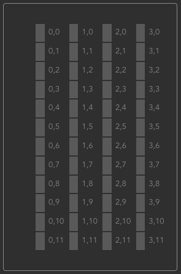

# Documentation

With this tool, it is possible to control litenet-controlled luminaires. 

This tool consists of two components. The luminaire-controller itself and the REPL. The controller accesses the
litenet web interface, parses the content and then executes the command by sending the corresponding form-requests to
the litenet server.

**Example, for the following floor-configuration:**



```
> on area 1,4 3,8
The area [1,4] to [3,8] is turned on (1515ms)
> on row 11
The row 11 is turned on (217ms)
> on row 1
The row 1 is turned on (265ms)
> 
```


## Supported commands

Most commands support different modes which define the scope to which the command will be applied to (e.g. only for a
certain column). 

**Existing modes**

- `all`: all luminaires that exist in the configuration
- `area`: an area, defined by two coordinate pairs (e.g. `1,3 3,8`)
- `col`: single column
- `row`: single row
- `single`: single luminaire, defined by a coordinate (e.g. `2,4`)
- `spiral`: spiral pattern over all configured luminaires


### `help`

Shows the list of available commands


### `brighter`

Dims luminaires brighter by the given steps.

Supported modes:

- `all`
- `area`
- `col`
- `row`
- `single`
- `spiral`

Example:

```
brighter area 1,3 2,5
```


### `darker`

Dims luminaires darker by the given steps.

Supported modes:

- `all`
- `area`
- `col`
- `row`
- `single`
- `spiral`

Example:

```
darker area 1,3 2,5
```


### `on`

Turns luminaires on.

Supported modes:

- `all`
- `area`
- `col`
- `row`
- `single`
- `spiral`

Example:

```
on area 1,3 2,5
```


### `off`

Turns luminaires off.

Supported modes:

- `all`
- `area`
- `col`
- `row`
- `single`
- `spiral`

Example:

```
off area 1,3 2,5
```


### `set`

Set options.

Supported options:

- `concurrent`: [true|false] enables the luminaire-controller to group all commands in the queue by luminaire and runs
  the command per luminaire sequentially, but all luminaire-queues concurrently. (**CAUTION: This is an experimental
  setting and may induce a DOS of the Litenet-server**)

Example:

```
set concurrent true
```

### `trail`

Turns luminaires on and after that, off again. This command is to create a "trailing" pattern.

Supported modes:

- `all`
- `area`
- `col`
- `row`
- `spiral`

Example:

```
trail col 3
```


### exit

Exits the shell.


## REPL

The entry point is a REPL in `src/repl/index.ts`. To parse the CLI arguments, the `cmd`-dependency (based on
[Commander.js](https://github.com/tj/commander.js)) is used.

The REPL requires following Deno-permissions:

- `--allow-net` to access the web-interface
- `--allow-env` for the `cmd`-dependency
- `--allow-read` to access the `exec_path` for parsing the arguments
- `--allow-write` for recording the command-history

The REPL component opens an interactive shell with then can be used to control the luminaires by commands and modes
(which define the scope to which the command will be applied to. e.g. an area).

## Luminaire-controller

The entry point for the Luminaire-controller is `src/lighting/index.ts`.

The controller provides an API to put commands into a queue, which then can be executed at once. Commands will be
executed sequentially, unless the controller was put into the concurrent mode where the commands will be grouped and
queued by luminaire and then the commands will be executed concurrently per luminaire.

A command can be a luminaire with an action applied to it (in most cases). Exceptions to that are actions that are not
luminaire-related (e.g. the "wait"-command).

The [LightPattern](../src/lighting/light-pattern.ts)-service is a util-script that helps to create a list of commands
based on luminaire-patterns (e.g. turning on an area of luminaires).

The [LuminairePattern](src/lighting/luminaire-pattern-builder.ts)-service creates a list of luminaire patterns
(e.g. area, column, spiral, ...) based on which commands can be created.


